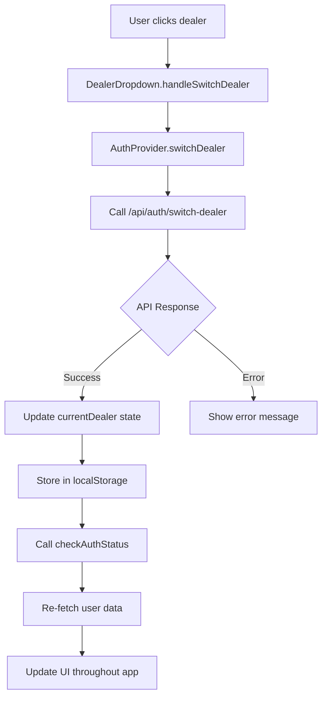

# Dealer Switching Implementation

## Overview

The dealer switching functionality allows users with access to multiple dealerships to seamlessly switch between them without losing their authentication state. This is a core multi-tenant feature that enables users to work across different dealership contexts within the same session.

## User Experience Flow

### 1. **Dealer Dropdown Visibility**
- The dealer dropdown only appears when a user has access to **2 or more dealers**
- Users with single dealer access see a static dealer name display
- The dropdown is typically located in the header/navigation area

### 2. **Dealer Selection Process**
```
User clicks dropdown → Sees list of available dealers → Selects new dealer → 
"Switching..." state → Smooth transition → Updated context throughout app
```

### 3. **Visual States**
- **Normal State**: Shows current dealer name with dropdown arrow
- **Loading State**: Shows "Switching..." with spinner animation
- **Disabled State**: Prevents multiple clicks during switching
- **Error State**: Shows error message if switch fails

### 4. **Persistence**
- Selected dealer is stored in `localStorage` as `titan-current-dealer`
- Dealer selection persists across browser sessions
- Falls back to user's `defaultDealerId` if no stored preference

## Technical Implementation

### Core Components

#### 1. **AuthProvider (`auth-provider-multitenancy.tsx`)**

**State Management:**
```typescript
const [currentDealer, setCurrentDealer] = useState<Dealer | null>(null);
const [user, setUser] = useState<UserProfile | null>(null);
```

**Key Functions:**
- `switchDealer(dealerId: string)`: Handles the dealer switching logic
- `checkAuthStatus()`: Re-fetches user data after dealer switch
- `hasRole(roles: UserRole[])`: Role-based access control

**Switch Dealer Flow:**
```typescript
const switchDealer = async (dealerId: string) => {
  // 1. Validate authentication
  // 2. Get Cognito token
  // 3. Call backend API to validate switch
  // 4. Update local state
  // 5. Store in localStorage
  // 6. Re-fetch user data (replaces window.location.reload())
};
```

#### 2. **DealerDropdown Component (`dealer-dropdown.tsx`)**

**Features:**
- Conditional rendering based on dealer count
- Loading states with spinner animations
- Disabled states during switching
- Error handling with user feedback

**State Management:**
```typescript
const [isSwitching, setIsSwitching] = useState(false);
```

### Backend API Endpoints

#### 1. **`/api/auth/me`**
- Returns user profile with dealer relationships
- Includes current dealer context
- Handles users not yet in internal system

#### 2. **`/api/auth/switch-dealer`**
- Validates user has access to requested dealer
- Verifies dealer exists and is active
- Returns success/failure response
- **Note**: Does not issue new tokens (uses existing Cognito JWT)

### Data Flow



## Current Implementation Benefits

### ✅ **Advantages**
1. **No Page Reload**: Smooth state updates without full page refresh
2. **Loading States**: Clear visual feedback during switching
3. **Error Handling**: Proper error recovery and user feedback
4. **Persistence**: Dealer selection survives browser sessions
5. **Security**: Validates dealer access on backend
6. **Performance**: Only re-fetches necessary data

### ⚠️ **Potential Issues & Limitations**

#### 1. **State Synchronization Risks**
**Issue**: If backend fails to update but frontend state changes, inconsistency can occur.

**Current Mitigation**: 
- Backend validation before state update
- Error handling with rollback capability

**Future Risk**: 
- Network failures during state update
- Race conditions with rapid switching

#### 2. **Data Consistency**
**Issue**: `checkAuthStatus()` re-fetches all user data, which may be inefficient.

**Current Behavior**: 
- Re-fetches entire user profile
- Updates all dealer relationships
- May cause unnecessary re-renders

#### 3. **Error Recovery**
**Issue**: Limited error recovery mechanisms.

**Current Limitations**:
- No retry logic for failed switches
- No offline handling
- Basic error messages (alert dialogs)

#### 4. **Performance Concerns**
**Issue**: Multiple API calls during dealer switch.

**Current Flow**:
1. Call `/api/auth/switch-dealer`
2. Call `checkAuthStatus()` → `/api/auth/me`
3. Potential additional data fetching

## Recommended Improvements

### 1. **Optimistic Updates**
```typescript
const switchDealer = async (dealerId: string) => {
  const previousDealer = currentDealer;
  
  // Optimistic update
  const newDealer = user?.dealers.find(d => d.id === dealerId);
  if (newDealer) {
    setCurrentDealer(newDealer);
    localStorage.setItem('titan-current-dealer', dealerId);
  }
  
  try {
    await fetch("/api/auth/switch-dealer", { ... });
    // Success - optimistic update was correct
  } catch (error) {
    // Rollback on failure
    setCurrentDealer(previousDealer);
    localStorage.setItem('titan-current-dealer', previousDealer?.id || '');
    throw error;
  }
};
```

### 2. **Selective Data Refetching**
```typescript
const switchDealer = async (dealerId: string) => {
  // ... existing validation ...
  
  // Instead of full checkAuthStatus(), only fetch dealer-specific data
  await refetchDealerSpecificData(dealerId);
};

const refetchDealerSpecificData = async (dealerId: string) => {
  // Only fetch data that changes with dealer context
  const [inventory, customers, reports] = await Promise.all([
    fetchDealerInventory(dealerId),
    fetchDealerCustomers(dealerId),
    fetchDealerReports(dealerId)
  ]);
  
  // Update only relevant state
  setDealerInventory(inventory);
  setDealerCustomers(customers);
  setDealerReports(reports);
};
```

### 3. **Enhanced Error Handling**
```typescript
const switchDealer = async (dealerId: string, retryCount = 0) => {
  try {
    // ... existing logic ...
  } catch (error) {
    if (retryCount < 3 && isRetryableError(error)) {
      // Exponential backoff retry
      await new Promise(resolve => setTimeout(resolve, 1000 * Math.pow(2, retryCount)));
      return switchDealer(dealerId, retryCount + 1);
    }
    
    // Show user-friendly error with recovery options
    showErrorToast({
      message: "Failed to switch dealer. Please try again.",
      action: "Retry",
      onAction: () => switchDealer(dealerId)
    });
  }
};
```

### 4. **Toast Notifications**
```typescript
// Replace alert() with toast notifications
import { toast } from 'react-hot-toast';

const handleSwitchDealer = async (dealerId: string) => {
  setIsSwitching(true);
  try {
    await switchDealer(dealerId);
    toast.success(`Switched to ${dealer.name}`);
  } catch (error: any) {
    toast.error(error.message || 'Failed to switch dealer');
  } finally {
    setIsSwitching(false);
  }
};
```

### 5. **Debounced Switching**
```typescript
import { useCallback } from 'react';
import { debounce } from 'lodash';

const debouncedSwitchDealer = useCallback(
  debounce(async (dealerId: string) => {
    await switchDealer(dealerId);
  }, 300),
  []
);
```

### 6. **Offline Support**
```typescript
const switchDealer = async (dealerId: string) => {
  if (!navigator.onLine) {
    // Store switch request for when online
    localStorage.setItem('pending-dealer-switch', dealerId);
    toast.info('Dealer switch will complete when online');
    return;
  }
  
  // ... existing logic ...
};

// Handle pending switches when coming back online
useEffect(() => {
  const handleOnline = () => {
    const pendingSwitch = localStorage.getItem('pending-dealer-switch');
    if (pendingSwitch) {
      switchDealer(pendingSwitch);
      localStorage.removeItem('pending-dealer-switch');
    }
  };
  
  window.addEventListener('online', handleOnline);
  return () => window.removeEventListener('online', handleOnline);
}, []);
```

## Testing Considerations

### Unit Tests
- Test dealer switching logic in isolation
- Test error handling scenarios
- Test state management updates

### Integration Tests
- Test full dealer switching flow
- Test API error responses
- Test localStorage persistence

### E2E Tests
- Test dealer switching from UI
- Test multiple rapid switches
- Test offline/online scenarios

## Monitoring & Analytics

### Key Metrics to Track
- Dealer switch success rate
- Average switch time
- Error frequency by error type
- User switching patterns

### Error Monitoring
- Track failed dealer switches
- Monitor API response times
- Alert on high error rates

## Security Considerations

### Current Security Measures
- Backend validation of dealer access
- JWT token verification
- User permission checks

### Additional Security Recommendations
- Audit logging of dealer switches
- Rate limiting on switch requests
- Session timeout handling
- Cross-dealer data isolation validation

## Conclusion

The current dealer switching implementation provides a solid foundation for multi-tenant functionality. The recent improvements (removing page reload, adding loading states) significantly enhance the user experience. However, there are opportunities for further optimization in terms of performance, error handling, and offline support.

The suggested improvements should be implemented incrementally, with proper testing at each stage to ensure system stability and user experience quality.
