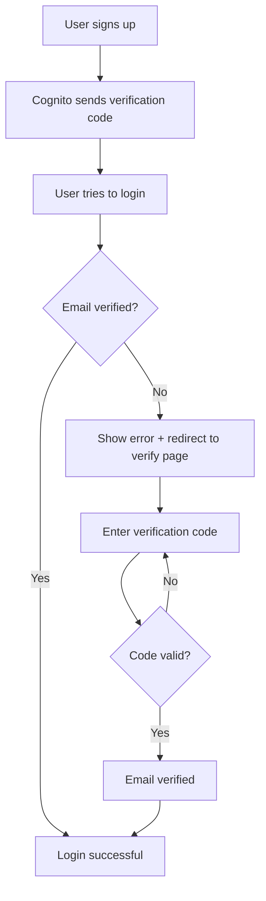

# Password Reset & Email Verification Implementation

## Overview

This document describes the complete password reset and email verification flows implemented for TITAN Forecast, using AWS Cognito with custom branding that matches our marketing website.

## Features Implemented

✅ **Password Reset Flow**
- Request password reset via email
- Receive 6-digit verification code
- Set new password with validation
- Success confirmation with auto-redirect

✅ **Email Verification Flow**
- Verify email with 6-digit code
- Magic link support (code pre-filled from email button)
- Resend verification code
- Auto-redirect after successful verification
- Deep linking from login errors

✅ **Custom Email Templates**
- Branded HTML emails matching TITAN Forecast design
- Maroon color scheme (#550000)
- Inter font family
- Mobile-responsive design

✅ **Login Flow Enhancements**
- "Forgot Password?" link always visible
- Automatic detection of unverified emails
- Auto-redirect to verification page when needed

## File Structure

```
frontend/
├── app/
│   └── (auth)/
│       ├── forgot-password/
│       │   └── page.tsx           # Password reset UI
│       └── verify-email/
│           └── page.tsx           # Email verification UI
├── lib/
│   └── cognito/
│       └── auth-flows.ts          # Cognito API helpers
├── email-templates/
│   ├── verification-email.html    # Email verification template
│   ├── password-reset-email.html  # Password reset template
│   └── README.md                  # Email template documentation
└── components/
    └── login-form.tsx             # Updated with verification handling
```

## User Flows

### 1. Password Reset Flow

```mermaid
graph TD
    A[User clicks "Forgot Password?"] --> B[Enter email address]
    B --> C[Cognito sends code to email]
    C --> D[User enters 6-digit code]
    D --> E[User enters new password]
    E --> F{Password valid?}
    F -->|Yes| G[Password updated]
    F -->|No| E
    G --> H[Redirect to login]
```

**Steps:**
1. User clicks "Forgot Password?" link on login page
2. Enters email address
3. Receives 6-digit code via email (custom branded template)
4. Enters code and new password
5. Password is validated against Cognito policy
6. Success screen shows, auto-redirects to login

**Routes:**
- Start: `/forgot-password`
- Success: Redirects to `/` (login)

### 2. Email Verification Flow



**Steps:**
1. New user signs up (creates Cognito account)
2. Cognito sends verification code via email
3. User tries to login before verifying
4. Login detects unverified state and redirects to `/verify-email?email=user@example.com`
5. User enters 6-digit code
6. Upon success, redirects to login with `?verified=true` flag
7. User can now log in

**Routes:**
- Verify page: `/verify-email?email=user@example.com`
- Success: Redirects to `/?verified=true`

## API Functions

### `lib/cognito/auth-flows.ts`

#### Password Reset

```typescript
// Request password reset (sends code to email)
requestPasswordReset(email: string): Promise<{
  success: boolean;
  destination?: string;  // Masked email (e.g., "u***@example.com")
  error?: string;
}>

// Confirm password reset with code
confirmPasswordReset(email: string, code: string, newPassword: string): Promise<{
  success: boolean;
  error?: string;
}>
```

#### Email Verification

```typescript
// Resend verification code
resendVerificationCode(email: string): Promise<{
  success: boolean;
  destination?: string;
  error?: string;
}>

// Verify email with code
verifyEmail(email: string, code: string): Promise<{
  success: boolean;
  error?: string;
}>
```

#### Password Validation

```typescript
// Validate password against Cognito policy
validatePassword(password: string): {
  valid: boolean;
  errors: string[];  // List of validation errors
}
```

**Cognito Password Policy:**
- Minimum 8 characters
- At least one uppercase letter
- At least one lowercase letter
- At least one number
- At least one special character (!@#$%^&*)

## Magic Link Feature

Both email templates include "magic links" that automatically pre-fill the verification code when users click the button in their email.

**How it works:**

1. **Email Template**: The button/link includes the code as a URL parameter
   ```html
   <a href="https://app.titanforecast.com/verify-email?email={username}&code={####}">
   ```

2. **Cognito Processing**: AWS Cognito replaces the placeholders before sending:
   - `{username}` → User's email address
   - `{####}` → The 6-digit verification code

3. **Frontend Handling**: Our Next.js pages detect URL parameters and auto-fill:
   ```typescript
   const emailParam = searchParams.get("email");
   const codeParam = searchParams.get("code");
   ```

4. **User Experience**: 
   - **Best case**: Click button → Code pre-filled → Click verify → Done!
   - **Fallback**: Manually enter the code if link doesn't work

**Benefits:**
- ✅ One-click verification (almost)
- ✅ Reduced user friction
- ✅ Better conversion rates
- ✅ Still supports manual entry for accessibility/fallback

**URLs Generated:**
- Email verification: `https://app.titanforecast.com/verify-email?email=user@example.com&code=123456`
- Password reset: `https://app.titanforecast.com/forgot-password?email=user@example.com&code=123456`

## Email Templates

### Configuration Required

The email templates must be configured in AWS Cognito User Pool settings. See `email-templates/README.md` for detailed instructions.

**Templates:**
1. `verification-email.html` - For email verification
2. `password-reset-email.html` - For password reset

**Placeholders:**
- `{####}` - 6-digit verification code
- `{##Verify Email##}` - Verification link (for email verification)
- `{##Reset Password##}` - Reset link (for password reset)

### Design Features

- **Branding**: Maroon primary color (#550000) matching TITAN Forecast
- **Typography**: Inter font family
- **Layout**: Responsive design with max-width 600px
- **Security**: Clear expiration times and warnings
- **Accessibility**: High contrast, readable fonts

## UI Components

### Forgot Password Page (`/forgot-password`)

**Features:**
- Clean, professional design matching login page
- Two-step flow: request code → enter code + new password
- Real-time password validation
- Resend code functionality
- Success screen with auto-redirect

**Styling:**
- Dark gradient background with animated blobs
- Maroon gradient header
- White content card with rounded corners
- Maroon CTA buttons

### Verify Email Page (`/verify-email`)

**Features:**
- Email pre-filled from query params
- 6-digit code input (numbers only)
- Resend code button
- Auto-redirect on success
- Error handling with user-friendly messages

**Styling:**
- Consistent with forgot-password page
- Green success state
- Loading indicators

### Login Form Updates

**Changes:**
1. **"Forgot Password?" link** always visible below password field
2. **Email verification detection**:
   - Catches verification errors from Cognito
   - Shows user-friendly message
   - Auto-redirects to `/verify-email?email=user@example.com`
3. **Error message enhancements**:
   - Still shows link in error box for redundancy
   - Graceful timeout handling

## Error Handling

### Common Errors

| Error | User-Friendly Message | Action |
|-------|----------------------|--------|
| `UserNotFoundException` | "No account found with this email address" | Check email or sign up |
| `CodeMismatchException` | "Invalid verification code. Please try again" | Re-enter code |
| `ExpiredCodeException` | "Verification code has expired. Please request a new one" | Resend code |
| `LimitExceededException` | "Too many attempts. Please try again later" | Wait and retry |
| `InvalidPasswordException` | "Password does not meet requirements..." | Show requirements |
| `NotAuthorizedException` | "Account already verified or does not exist" | Login or contact support |

### Error Flow

All errors are:
1. Caught and logged
2. Translated to user-friendly messages
3. Displayed in styled error boxes
4. Actionable (with "Resend Code" or "Try Again" options)

## Testing Checklist

- [ ] **Password Reset**
  - [ ] Request code with valid email
  - [ ] Request code with invalid email (should show error)
  - [ ] Enter correct code and valid password
  - [ ] Enter incorrect code (should show error)
  - [ ] Enter valid code with weak password (should show requirements)
  - [ ] Test "Resend Code" button
  - [ ] Verify success redirect to login
  - [ ] Test email template rendering

- [ ] **Email Verification**
  - [ ] Sign up new user
  - [ ] Receive verification email
  - [ ] Try to login before verifying (should redirect to verify page)
  - [ ] Enter correct verification code
  - [ ] Enter incorrect code (should show error)
  - [ ] Test "Resend Code" button
  - [ ] Verify success redirect to login
  - [ ] Login after verification (should work)

- [ ] **Login Flow**
  - [ ] "Forgot Password?" link visible and clickable
  - [ ] Unverified email error shows proper message
  - [ ] Auto-redirect works for unverified emails
  - [ ] Normal login still works for verified users

- [ ] **Email Templates**
  - [ ] Templates configured in Cognito
  - [ ] Emails render correctly in Gmail
  - [ ] Emails render correctly in Outlook
  - [ ] Emails render correctly on mobile
  - [ ] Links work correctly
  - [ ] Codes are properly displayed

## Next Steps

### Immediate (Before Production)

1. **Configure Email Templates in Cognito**
   - Upload templates to staging user pool
   - Test email delivery and rendering
   - Update templates if needed

2. **Update Cognito Settings**
   - Verify SES sender domain configured
   - Set up proper "from" email address
   - Configure email rate limits

3. **Test Thoroughly**
   - Run through all test cases
   - Test on multiple devices/browsers
   - Verify email delivery

### Future Enhancements

1. **Rate Limiting**
   - Add client-side rate limiting for resend buttons
   - Show countdown timer (e.g., "Resend in 60 seconds")

2. **Analytics**
   - Track password reset requests
   - Track email verification success rates
   - Monitor failed attempts

3. **Improved UX**
   - Auto-submit when 6-digit code is complete
   - Password strength indicator
   - Toast notifications for success messages

4. **Security**
   - Add CAPTCHA for password reset requests
   - Implement account lockout after too many failed attempts
   - Add security questions (optional)

## Troubleshooting

### "Email not sending"
- Check SES configuration and sender verification
- Verify email address is not in SES sandbox
- Check CloudWatch logs for Cognito errors

### "Template not rendering"
- Ensure templates are properly configured in Cognito
- Check for HTML syntax errors
- Verify placeholder syntax is correct

### "Verification code not working"
- Check if code has expired (24 hours for verification, 1 hour for reset)
- Ensure user is entering code for correct email
- Verify Cognito user pool configuration

### "Redirect not working"
- Check Next.js router configuration
- Verify route paths match
- Check browser console for navigation errors

## Related Documentation

- [Cognito User Integration](./cognito-user-integration.md)
- [Email Templates README](../email-templates/README.md)
- [Infrastructure - Cognito Setup](../../infrastructure/cognito.tf)
- [AWS Amplify Documentation](https://docs.amplify.aws/)

